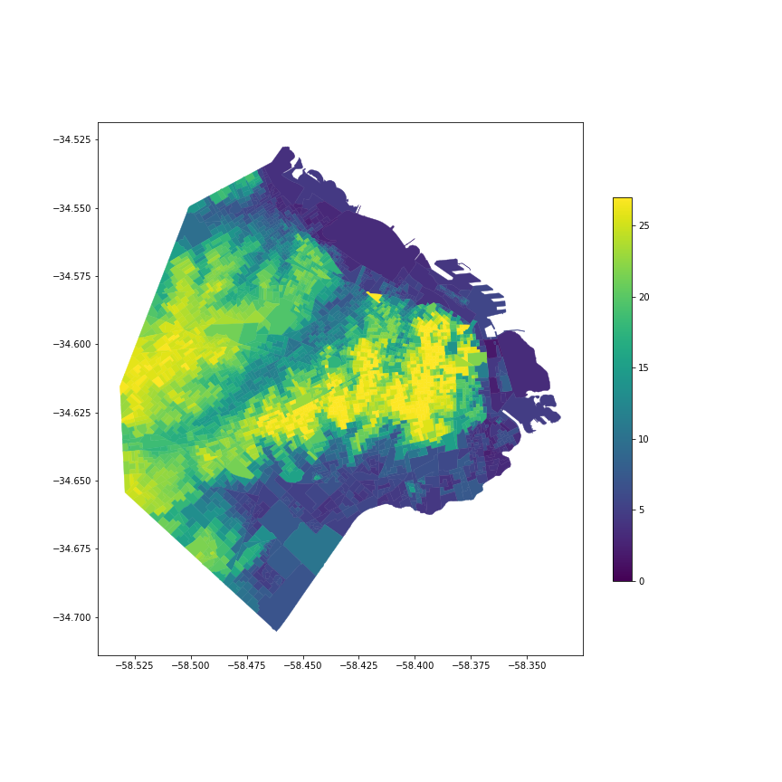

### Acerca de este recurso:

Este repositorio contiene un codigo simple para obtener la elevacion de centroides de radios censales segun la Elevation API de Google Maps. 

El repositorio contiene tambien un archivo GeoJSON con los resultados de la consulta a la API. Asi, las elevaciones estan ya disponibles para usar sin necesidad de suscribirse a la API de Google.

Estos recursos permiten estimar la distribucion de la poblacion argentina por elevacion. Es por tanto un recurso util para la caracterizacion de los riesgos climaticos que enfrenta la poblacion en Argentina, en particular por la suba del nivel del mar prevista a causa del calentamiento antropogénico.

### Demo: Elevaciones de Capital Federal

Se muestran a modo ilustrativo las elevaciones de la Capital Federal en el archivo `elevacionesARG.geojson`.

